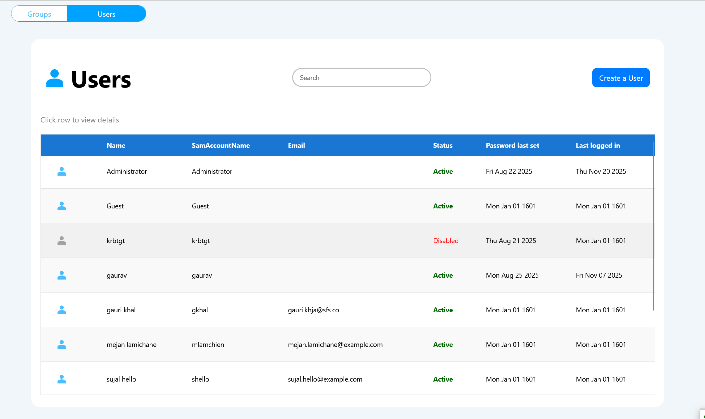
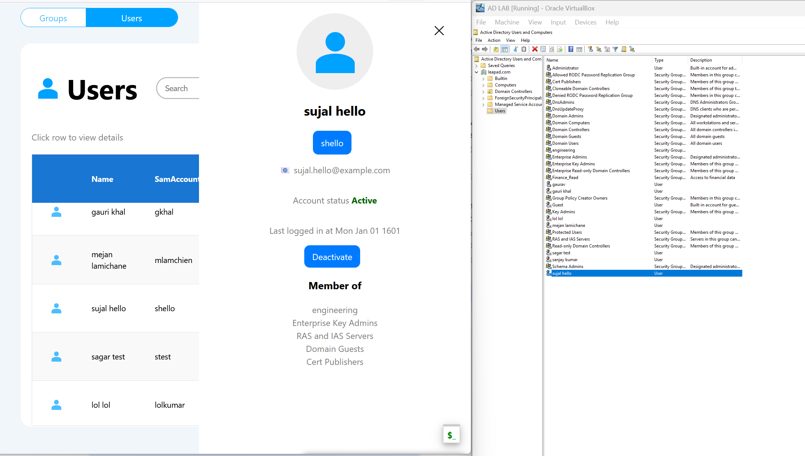
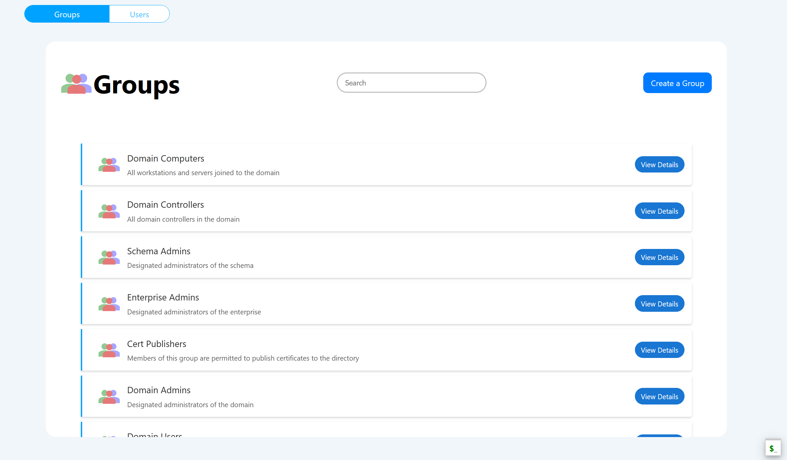

# Active Directory Management System

A full-stack web application for managing Active Directory users and groups through a modern web interface.

## Overview

**LeapAD – Simplifying Active Directory Management**
LeapAD is a modern, serverless web application designed to streamline Active Directory (AD) administration through an intuitive and secure interface. Built with React, Flask, and LDAP3, it eliminates the need for costly third-party tools like Okta by offering seamless AD integration, near-zero infrastructure management, and robust cloud-based performance. With features such as user and group management, role-based access, and planned enhancements like AD auditing and multi-domain support, LeapAD empowers organizations to manage their directories efficiently and cost-effectively

## Challenges Faced Before LeapAD Was Introduced:
- Manual Active Directory (AD) management was time-consuming and error-prone.
- Administrators struggled with complex LDAP commands and scripts.
- Lack of a centralized interface made tracking users and groups difficult.
- Onboarding and offboarding processes were slow and inconsistent.
- Limited visibility and reporting on AD changes led to compliance risks.
- Collaboration between IT teams was fragmented and inefficient.
- Reliance on third-party solutions like Okta was expensive, increasing operational costs.

## Architecture

- **Frontend**: React application with Vite build system
- **Backend**: Flask REST API with LDAP3 integration
- **Functions**: AWS Lambda functions for extended functionality
- **CI/CD**: GitHub Actions with Docker containerization

## Features

### User Management
- Create, read, update, and delete AD users
- Manage user attributes (name, email, group memberships)
- View user group memberships
- Bulk user operations

### Group Management
- Create, read, update, and delete AD groups
- Add/remove users from groups
- View group members
- Group attribute management

### Security
- Secure LDAP connections (LDAPS/StartTLS)
- Environment-based configuration
- CORS-enabled API endpoints

## Screenshots

**Users Page**






**Groups Page**



.png)


.png)


## Tech Stack

**Frontend:**
- React 18
- React Router DOM
- Axios for API calls
- Vite for development and building

**Backend:**
- Flask web framework
- LDAP3 for Active Directory integration
- Flask-CORS for cross-origin requests
- Python-dotenv for configuration

**Infrastructure:**
- AWS Lambda functions
- Docker containerization
- GitHub Actions CI/CD

## Quick Start

1. **Backend Setup**:
   ```bash
   cd backend
   pip install -r requirements.txt
   cp .env.example .env
   # Configure your AD settings in .env
   python app.py
   ```

2. **Frontend Setup**:
   ```bash
   cd frontend
   npm install
   npm run dev
   ```

## Configuration

Configure your Active Directory connection in `backend/.env`:
- `USER_DN`: Service account DN
- `PASSWORD`: Service account password
- `SERVER_ADDRESS`: AD server address
- `BASE_DN_USERS`: Users base DN
- `BASE_DN_GROUPS`: Groups base DN
- `DEFAULT_GROUP_DN`: Default group for new users

## API Endpoints

- `GET /users` - List all users
- `POST /users` - Create new user
- `PUT /users` - Update user
- `DELETE /users` - Delete user
- `GET /groups` - List all groups
- `POST /groups` - Create new group
- `PUT /groups` - Update group
- `DELETE /groups` - Delete group

## Development

The application supports hot reloading in development mode and includes comprehensive error handling for LDAP operations.